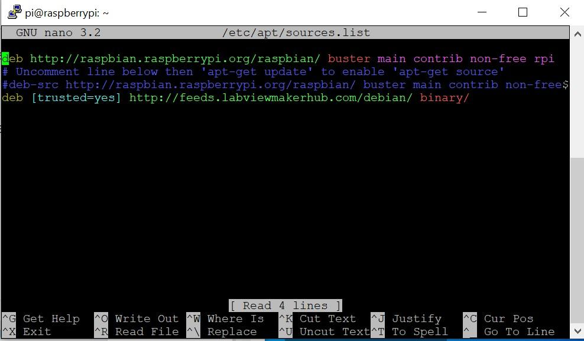

1. Install
---------------

Here is the procedure that I used to install LINX. The procedure also works on the Raspberry Pi 2B, Pi 3A+, Pi 3B and Pi 3B+ running Raspbian Buster.

1. Setup the Raspberry Pi using the latest Raspbian Buster Image.
2. Change the default password for the Pi account on the Raspberry Pi.
3. Setup a WiFi or Ethernet connection from the Raspberry Pi to your router.
4. Enable SSH on the Raspberry Pi.
5. SSH into the Raspberry Pi or open a terminal window on the Raspberry Pi desktop.
6. Check that the Raspberry Pi can access the Internet by entering the command

ping -c 4 raspberrypi.org

7. Enter the commands shown in bold below. 
Note: The text may wrap due to the web browser window size. I recommend copying the text into a text editor to see the original formatting. The commands are in the attached file linx_install_commands.txt
```
# Enable i2c and spi
sudo raspi-config nonint do_i2c 0
sudo raspi-config nonint do_spi 0
# Update Raspbian
sudo apt-get update
sudo apt-get dist-upgrade -y
# Install LINX
sudo sh -c 'echo "deb [trusted=yes] http://feeds.labviewmakerhub.com/debian/ binary/" >> /etc/apt/sources.list'
sudo apt-get update
sudo apt-get install -y lvrt-schroot
# Move the nisysserver.service and labview.service files to the systemctl folder
sudo mv /etc/systemd/system/multi-user.target.wants/nisysserver.service /lib/systemd/system
sudo mv /etc/systemd/system/multi-user.target.wants/labview.service /lib/systemd/system
# link liblinxdevice.so to the Raspberry PI device driver file liblinxdevice_rpi2.so
sudo schroot -c labview -d /usr/lib -- ln -s  liblinxdevice_rpi2.so liblinxdevice.so
# Enable the nisysserver.service and labview.service to start on boot
sudo systemctl enable nisysserver.service
sudo systemctl enable labview.service
# Start the nisysserver.service and labview.service
sudo systemctl start nisysserver.service
sudo systemctl start labview.service
```

You should now be able to connect to the Raspberry Pi from the LabVIEW Project Explorer.

2. FixBug.

```
sudo sh -c 'echo "deb [trusted=yes] http://feeds.labviewmakerhub.com/debian/ binary/" >> /etc/apt/sources.list'
sudo apt-get update

the following errors occur:

E: Conflicting values set for option Trusted regarding source http://feeds.labviewmakerhub.com/debian/ binary/
E: The list of sources could not be read.
```
fix:
```
sudo nano /etc/apt/sources.list

modify the text file according to the attached picture. use control+x to exit. press y to confirm to save the file.
```
